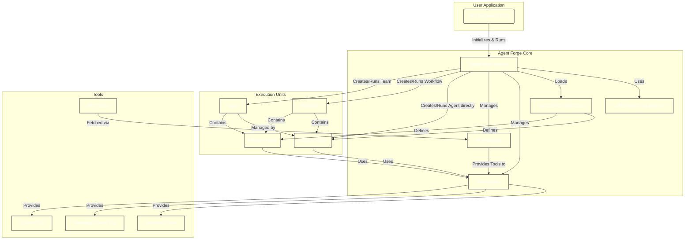

# Agent Forge 🔨

[](https://www.typescriptlang.org/)
[](https://opensource.org/licenses/MIT)
[](https://frostlogic-ab.github.io/agent-forge/)

Agent Forge is a TypeScript framework for creating, configuring, and orchestrating AI agents that connect to LLMs (Large Language Models). It allows developers to define agents through YAML configuration files and enables both sequential and hierarchical execution patterns. Its core goal is to simplify the development of sophisticated agent-based applications by providing a structured approach to agent definition, tool integration, and multi-agent collaboration.

##  Table of Contents

- [Features](#features)
- [Architecture Overview](#architecture-overview)
- [Installation](#installation)
- [Quick Start](#quick-start)
  - [Create Agent Forge Instance](#1-create-agent-forge-instance)
  - [Define Agent in YAML](#2-define-your-agent-in-a-yaml-file)
  - [Run Single Agent](#3-create-and-run-your-agent)
  - [Create Sequential Workflow](#4-create-a-workflow-of-sequential-agents)
  - [Create Agent Team](#5-create-a-hierarchical-team-with-a-manager-agent)
  - [Use Rate Limiting](#6-use-rate-limiting-to-avoid-api-quota-issues)
  - [Debug Interactions](#7-debug-team-interactions-with-verbose-logging)
  - [Stream Communications](#8-stream-agent-communications-in-real-time)
  - [Use Model Context Protocol](#9-use-model-context-protocol-mcp-to-extend-agent-capabilities)
  - [Agent-to-Agent (A2A) Communication](#10-agent-to-agent-(A2A)-communication)
- [Development](#development)
- [Documentation](#documentation)
- [Contributing](#contributing)
- [License](#license)

---

## ✨ Features

- 📝 **YAML-Defined Agents**: Configure agents with role, description, and objectives through simple YAML files
- 🧰 **Tool Ecosystem**: Extend agents with custom tools to interact with external systems
- 🔄 **Flexible Execution Patterns**:
  - Sequential execution (workflow-based)
  - Hierarchical execution (manager AI delegates to specialized agents)
- 🔌 **LLM Integration**: Connect to various language models through a unified interface. Powered by [`token.js`](https://github.com/token-js/token.js), Agent Forge supports all LLMs compatible with `token.js`. For a detailed list of supported providers, please refer to the [`token.js` documentation](https://github.com/token-js/token.js/tree/main?tab=readme-ov-file#supported-providers).
- 🚦 **Rate Limiting**: Control API usage with built-in rate limiting to avoid quota issues
- 📡 **Streaming Support**:
  - Stream agent communications in real-time
  - Console streaming for immediate visibility of agent outputs
- 🔍 **Debugging Features**:
  - Verbose logging of agent interactions with detailed execution flow
  - Real-time visibility into task assignments and dependencies
  - Comprehensive progress tracking and error reporting
  - Visual indicators for task status and execution timing
- 🔗 **Model Context Protocol (MCP)**: Connect to external tool servers using standardized protocols
- 📊 **TypeScript Support**: Built with TypeScript for type safety and better developer experience

---

## 🏗️ Architecture Overview

The following diagram illustrates the core components of Agent Forge and how they interact:



**Key Component Interactions:**

- **Your Application** initializes an `AgentForge` instance and an `LLM` provider.
- **AgentForge** is the central orchestrator. It loads agent definitions from **YAML files**, manages a **ToolRegistry**, and can utilize an **MCPManager** for external tools.
- **Agents** are defined by their roles, objectives, and the tools they can use. They execute tasks using the configured **LLM provider**.
- **Tools** (like `WebSearchTool`, `WebPageContentTool`, your custom tools, or tools from MCP) provide specific functionalities to Agents.
- **Workflows** define sequences of Agents to execute tasks step-by-step.
- **Teams** allow for hierarchical task execution, where a manager Agent delegates tasks to member Agents.
- **MCPManager** connects to external Model Context Protocol servers to dynamically make their tools available within Agent Forge.

---

## 📦 Installation

Choose your preferred packageManager:

```bash
# npm
npm install agent-forge

# yarn
yarn add agent-forge

# pnpm
pnpm add agent-forge
```

### Prerequisites

- **Node.js**: Agent Forge is a TypeScript framework and requires Node.js to run. We recommend using the latest LTS version.
- **LLM API Keys**: To connect to Large Language Models, you will need API keys from your chosen provider (e.g., OpenAI, Anthropic).

---

## 🚀 Quick Start

### 1. Create Agent Forge instance

```typescript
import { AgentForge, LLM } from "agent-forge";

// Create an LLM provider
// Replace 'YOUR_OPENAI_API_KEY' with your actual OpenAI API key
// You can use one of the available TokenJS providers from here:
// https://github.com/token-js/token.js/tree/main?tab=readme-ov-file#supported-providers
const apiKey = process.env.OPENAI_API_KEY || "YOUR_OPENAI_API_KEY"; // Example: load from env or use a placeholder

const llmProvider = new LLM("openai", {
  apiKey,
});

// Create the AgentForge instance
const forge = new AgentForge(llmProvider);
```

### 2. Define your agent in a YAML file

```yaml
# agent.yaml
name: ResearchAgent
role: Research Assistant
description: An agent that helps with online research
objective: Find accurate and relevant information based on user queries
model: gpt-4
temperature: 0.7
tools:
  - name: WebSearch
    description: Search the web for information
```

#### Extending Agent Capabilities with Custom Tools

Agent Forge allows you to create and integrate your own custom tools to extend agent capabilities beyond built-in or MCP-provided tools. Here's a brief overview:

1.  **Create a Custom Tool Class**: Your custom tool should extend the base `Tool` class and implement the `run` method.

    ```typescript
    // src/tools/my-custom-tool.ts
    import { Tool, ToolParameter } from "agent-forge";

    export class MyCustomTool extends Tool {
      constructor() {
        const parameters: ToolParameter[] = [
          {
            name: "inputData",
            type: "string",
            description: "Data to process",
            required: true,
          },
        ];
        super("MyCustomTool", "Processes custom data.", parameters, "Returns a processing status.");
      }

      protected async run(params: { inputData: string }): Promise<any> {
        console.log(`MyCustomTool received: ${params.inputData}`);
        // Your custom tool logic here
        return { status: "processed", input: params.inputData };
      }
    }
    ```

2.  **Register Your Custom Tool**:
    -   **With AgentForge Instance (for global availability)**:
        ```typescript
        import { MyCustomTool } from "./src/tools/my-custom-tool"; // Adjust path as needed
        // ... (forge instance setup)
        const myTool = new MyCustomTool();
        forge.registerTool(myTool);
        ```
        Agents created or run via this `forge` instance (e.g., through `runWorkflow` or `runTeam`) can then access "MyCustomTool" if listed in their YAML, or if tools are dynamically provided.

    -   **Directly with an Agent**:
        ```typescript
        import { MyCustomTool } from "./src/tools/my-custom-tool";
        // ... (agent loading/creation)
        const myTool = new MyCustomTool();
        agent.addTool(myTool);
        ```

3.  **Use in Agent YAML**:
    ```yaml
    # agent-using-custom-tool.yaml
    name: MySpecialAgent
    # ... other properties
    tools:
      - name: MyCustomTool
        description: Processes custom data.
      - name: WebSearch # Can mix with other tools
        description: Search the web for information
    ```

This allows for a highly modular and extensible tool system tailored to your specific needs.

### 3. Create and run your agent

```typescript
import { loadAgentFromYaml } from "agent-forge";
// This example assumes 'forge' (an AgentForge instance from Example 1) is in scope.
// 'forge' should be initialized with an LLM provider:
// const forge = new AgentForge(llmProvider); // From Example 1

// Load agent from YAML file (e.g., the agent.yaml defined in step 2)
const agent = await loadAgentFromYaml("./agent.yaml");

// Register the agent with the AgentForge instance.
// This applies the default LLM provider (set on 'forge') to the agent.
// If the agent definition in YAML lists tools, ensure those tools are registered
// either globally with the AgentForge instance (e.g., `forge.registerTool(new WebSearchTool())`)
// or directly with the agent (e.g., `agent.addTool(new WebSearchTool())`) if not using AgentForge's dynamic tool injection.
// AgentForge's `runWorkflow` and `runTeam` methods automatically provide registered Forge tools to agents.
forge.registerAgent(agent);

// Run the agent
const result = await agent.run("What are the latest developments in AI?");
console.log(result);
```

### 4. Create a workflow of sequential agents

```typescript
import { Workflow, loadAgentFromYaml } from "agent-forge";
// Assumes 'forge' (AgentForge instance from Example 1) is in scope.

// Load multiple agents (ensure these YAML files exist, e.g., research-agent.yaml, summary-agent.yaml)
const researchAgent = await loadAgentFromYaml("./research-agent.yaml");
// Register the agent with AgentForge to apply the default LLM provider
forge.registerAgent(researchAgent);

const summaryAgent = await loadAgentFromYaml("./summary-agent.yaml");
// Register the agent with AgentForge to apply the default LLM provider
forge.registerAgent(summaryAgent);

// Create a workflow
const workflow = new Workflow().addStep(researchAgent).addStep(summaryAgent);

// Run the workflow
const result = await workflow.run(
  "Explain quantum computing advancements in 2023"
);
console.log(result);
```

### 5. Create a hierarchical team with a manager agent

```typescript
import { Team, loadAgentFromYaml } from "agent-forge";
// Assumes 'forge' (AgentForge instance from Example 1) is in scope.

// Load manager and specialized agents (ensure these YAML files exist)
const managerAgent = await loadAgentFromYaml("./manager-agent.yaml");
forge.registerAgent(managerAgent); // Register to apply default LLM provider

const codeAgent = await loadAgentFromYaml("./code-agent.yaml");
forge.registerAgent(codeAgent); // Register to apply default LLM provider

const designAgent = await loadAgentFromYaml("./design-agent.yaml");
forge.registerAgent(designAgent); // Register to apply default LLM provider

// Create a team with a manager
const team = new Team(managerAgent).addAgent(codeAgent).addAgent(designAgent);

// Run the team
const result = await team.run("Create a landing page for our new product");
console.log(result);
```

### 6. Use rate limiting to avoid API quota issues

Agent Forge helps you manage LLM API usage with built-in rate limiting. You can specify the maximum number of LLM calls per minute for `Team` and `Workflow` executions.

```typescript
import { Team, Workflow, loadAgentFromYaml } from "agent-forge";
// Assumes 'forge' (AgentForge instance from Example 1) is in scope and agents are registered.

// Load agents
const managerAgent = await loadAgentFromYaml("./manager-agent.yaml");
forge.registerAgent(managerAgent);
const researchAgent = await loadAgentFromYaml("./research-agent.yaml");
forge.registerAgent(researchAgent);
const summaryAgent = await loadAgentFromYaml("./summary-agent.yaml");
forge.registerAgent(summaryAgent);

// For a Team:
const team = new Team(managerAgent)
  .addAgent(researchAgent)
  .addAgent(summaryAgent);

const teamResult = await team.run(
  "What is quantum computing and how might it affect cybersecurity?",
  { rate_limit: 20 } // Max 20 LLM calls per minute for this team execution
);
console.log("Team Result:", teamResult.output);

// For a Workflow:
const workflow = new Workflow()
  .addStep(researchAgent)
  .addStep(summaryAgent);

const workflowResult = await workflow.run(
  "Explain the impact of blockchain on financial systems",
  { rate_limit: 10 } // Max 10 LLM calls per minute for this workflow execution
);
console.log("Workflow Result:", workflowResult.output);
```
This feature is crucial for preventing unexpected costs and staying within API provider quotas, especially in complex multi-agent scenarios.

### 7. Debug team interactions with verbose logging

```typescript
import { Team, loadAgentFromYaml } from "agent-forge";

// Load manager and specialized agents
const managerAgent = await loadAgentFromYaml("./manager-agent.yaml");
const researchAgent = await loadAgentFromYaml("./research-agent.yaml");
const summaryAgent = await loadAgentFromYaml("./summary-agent.yaml");

// Create a team with a manager
const team = new Team(managerAgent)
  .addAgent(researchAgent)
  .addAgent(summaryAgent);

// Run the team with verbose logging
const result = await team.run(
  "What are the ethical implications of AI in healthcare?",
  { verbose: true }
);
console.log("Final result:", result.output);
```

#### Verbose Output Example

When verbose logging is enabled, you'll see detailed information about:

```
🚀 Starting team execution with 2 agents and 1 manager
📋 Task: "What are the ethical implications of AI in healthcare?"

👨‍💼 Manager (Initial Plan):
Assigning tasks to team members...

🔄 System: Created task task-0 for Researcher: Research current AI applications in healthcare
📌 Dependencies: none

⏳ Starting task task-0 for agent "Researcher"...
👤 Researcher (Task task-0):
[Research findings...]
✅ Task task-0 completed in 2.34s

📊 Progress Report:
Completed Tasks:
- Task task-0 (Researcher): [Research results...]

👨‍💼 Manager:
[Next instructions...]

🏁 All tasks completed. Generating final result...
✅ Team execution completed successfully
```

You can also combine options:

```typescript
// Run with both rate limiting and verbose logging
const result = await team.run(
  "Explain the impact of blockchain on financial systems",
  {
    rate_limit: 15, // Limit to 15 LLM calls per minute
    verbose: true, // Enable detailed logging
  }
);
```

### 8. Stream agent communications in real-time

```typescript
import { Workflow, loadAgentFromYaml } from "agent-forge";
import { AgentForgeEvents, globalEventEmitter } from "agent-forge";

// Load multiple agents
const researchAgent = await loadAgentFromYaml("./research-agent.yaml");
const summaryAgent = await loadAgentFromYaml("./summary-agent.yaml");

// Set up event listeners for streaming
globalEventEmitter.on(AgentForgeEvents.AGENT_THINKING, (data) => {
  console.log(`Agent ${data.name} thinking: ${data.thought}`);
});

globalEventEmitter.on(AgentForgeEvents.AGENT_RESPONSE, (data) => {
  console.log(`Agent ${data.name} responded: ${data.response}`);
});

globalEventEmitter.on(AgentForgeEvents.EXECUTION_COMPLETE, (data) => {
  console.log(`Execution complete for ${data.type} "${data.name}"`);
});

// Create a workflow with streaming enabled
const workflow = new Workflow().addStep(researchAgent).addStep(summaryAgent);

// Run the workflow with streaming enabled
const result = await workflow.run(
  "Explain quantum computing advancements in 2023",
  { stream: true }
);
```

For console streaming, you can also use:

```typescript
const result = await workflow.run(
  "Explain quantum computing advancements in 2023",
  {
    stream: true,
    enableConsoleStream: true,
  }
);
```

#### Streaming Benefits

With streaming enabled, you'll receive real-time updates about:

- Agent thinking processes
- Agent responses
- Execution completion events

This is particularly useful for:

- Building reactive UIs that show progress to users
- Debugging complex agent interactions
- Creating logging systems for agent behavior
- Providing immediate feedback during long-running tasks

You can combine streaming with other options:

```typescript
// Run with streaming, rate limiting, and verbose logging
const result = await workflow.run(
  "Explain the impact of blockchain on financial systems",
  {
    stream: true, // Enable streaming of agent communications
    enableConsoleStream: true, // Enable console streaming for visibility
    rate_limit: 15, // Limit to 15 LLM calls per minute
    verbose: true, // Enable detailed logging
  }
);
```

### 9. Use Model Context Protocol (MCP) to extend agent capabilities

Agent Forge supports the Model Context Protocol (MCP), which allows agents to connect to external tool servers and use their capabilities. This section demonstrates how to integrate MCP clients, making it a more advanced example for significantly extending agent functionalities.

```typescript
import {
  Agent,
  LLM,
  MCPManager,
  createMCPClient,
  MCPProtocolType,
} from "agent-forge";

// Create an LLM provider
const llmProvider = new LLM("openai", {
  apiKey: process.env.OPENAI_API_KEY,
});

// Create an MCP manager
const mcpManager = new MCPManager();

// Connect to a local MCP server using STDIO
const stdioClient = createMCPClient(MCPProtocolType.STDIO, {
  command: "python",
  args: ["./path/to/mcp_server.py"],
  env: { API_KEY: "your-api-key" },
  verbose: true,
});
await mcpManager.addClient(stdioClient);

// Connect to a remote MCP server using Streamable HTTP (recommended)
const streamableHttpClient = createMCPClient(MCPProtocolType.STREAMABLE_HTTP, {
  baseUrl: "https://your-mcp-server.example.com/mcp",
  headers: { Authorization: "Bearer your-token" },
});
await mcpManager.addClient(streamableHttpClient);

// Connect to a legacy MCP server using SSE (deprecated)
// Note: SSE is deprecated in favor of Streamable HTTP
const sseClient = createMCPClient(MCPProtocolType.SSE, {
  url: "https://your-legacy-mcp-server.example.com/sse",
  headers: { Authorization: "Bearer your-token" },
});
await mcpManager.addClient(sseClient);

// Get all tools from the MCP servers
const mcpTools = mcpManager.getTools();

// Create an agent with MCP tools
const agent = new Agent({
  name: "MCP-Enabled Agent",
  role: "Assistant with extended capabilities",
  model: "gpt-4-turbo",
  temperature: 0.7,
}, mcpTools);

// Run the agent
const result = await agent.run(
  "Analyze this data using the specialized tools."
);
console.log(result);

// Always close connections when done
await mcpManager.close();
```

With MCP support, your agents can:

- Connect to specialized tool servers
- Access hundreds of third-party services
- Extend capabilities without modifying the agent framework
- Standardize tool interactions across different providers

You can run the MCP example with:

```bash
yarn example:mcp
```

---

## 10. Agent-to-Agent (A2A) Communication

Agent Forge now supports an Agent-to-Agent (A2A) communication protocol, enabling agents to interact with each other, even if they are running in separate processes or on different machines. This allows for the creation of more complex and distributed multi-agent systems.

The A2A protocol is built on JSON-RPC and can operate over HTTP/HTTPS. It allows one agent (a "client" or "manager" agent) to send tasks to another agent (a "server" agent) and receive results, including streaming updates.

### Key A2A Components:

-   **`A2AServer`**: Hosts an Agent Forge agent, making it available for remote task execution via the A2A protocol. It exposes an endpoint where client agents can send tasks.
-   **`A2AClient`**: Used by an agent to communicate with an `A2AServer`. It handles the underlying JSON-RPC communication.
-   **`RemoteA2AAgent`**: A specialized Agent Forge `Agent` that acts as a local proxy for a remote agent. When `RemoteA2AAgent.run()` is called, it uses an `A2AClient` to delegate the task to the actual agent running on an `A2AServer`. This allows a manager agent to use a remote agent almost as if it were a local tool or a directly instantiated agent.

### Running the A2A Examples:

Two example files are provided in the `src/examples/` directory to demonstrate A2A communication:

1.  **`a2a-server-example.ts`**: This script starts an `A2AServer` that hosts a simple "HelpfulAssistantAgent".
2.  **`a2a-team-example.ts`**: This script demonstrates a "manager" agent that uses a `RemoteA2AAgent` to connect to the server agent started by `a2a-server-example.ts` and delegate a task to it.

**Prerequisites:**
*   Ensure you have an OpenAI API key set up either as an environment variable (`OPENAI_API_KEY`) or directly in the example files (not recommended for production).

**Steps to run the examples:**

1.  **Compile the TypeScript code:**
    ```bash
    npm run build
    # or
    yarn build
    # or
    pnpm build
    ```

2.  **Start the A2A Server:**
    Open a terminal and run:
    ```bash
    node dist/examples/a2a-server-example.js
    ```
    You should see output indicating the server has started, typically on `http://localhost:41241/a2a`.

3.  **Run the A2A Team Example (Client):**
    Open another terminal and run:
    ```bash
    node dist/examples/a2a-team-example.js
    ```
    This script will connect to the running A2A server, send a task, and print the response from the remote "HelpfulAssistantAgent".

This setup demonstrates how a local agent can seamlessly delegate tasks to a remote agent, opening up possibilities for building distributed agent teams. The communication handles task lifecycle, status updates, and artifact (output) retrieval. While the current client supports polling and a basic structure for SSE streaming (for `tasks/sendSubscribe`), the full SSE client implementation for JSON-RPC initiated over POST is a complex area and may be further developed.

---

## 🛠️ Development

### Code Linting and Formatting

This project uses [Biome](https://biomejs.dev/) for linting and formatting TypeScript code. Biome is a fast, modern tool that replaces ESLint, Prettier, and more in a single package.

To lint the codebase:

```bash
yarn lint
```

To automatically fix issues:

```bash
yarn lint:fix       # Apply safe fixes only
yarn lint:fix:all   # Apply all fixes including unsafe ones
```

To format code:

```bash
yarn format
```

If you're using VS Code, install the [Biome extension](https://marketplace.visualstudio.com/items?itemName=biomejs.biome) to get real-time linting and formatting.

---

## 📖 Documentation

For complete documentation, please visit [our documentation site](https://frostlogic-ab.github.io/agent-forge/).

---

## 👥 Contributing

Contributions are welcome! Please see [CONTRIBUTING.md](./CONTRIBUTING.md) for details.

---

## 📄 License

MIT
